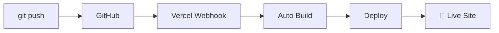

# My Slidev Presentations

This repository contains multiple Slidev presentations with **automatic Vercel deployment** via CI/CD.

## 🎯 特徴

- ✅ **複数プレゼンテーション対応**: フォルダ別に整理された構成
- ✅ **自動デプロイ**: GitHub push → Vercel 自動更新
- ✅ **美しいインデックス**: 全プレゼンテーションの一覧ページ
- ✅ **SEO対応**: robots.txt、sitemap.xml自動生成
- ✅ **レスポンシブ**: PC・スマートフォン対応
- ✅ **高速**: Vercel CDNによるグローバル配信

## 📁 Structure

```
.
├── SRE-NEXT-2025/          # SRE NEXT 2025 presentation
│   └── slides.md            # Main slides content
├── scripts/
│   └── build-index.js       # Script to build index page
├── docs/
│   └── VERCEL_SETUP.md      # Vercel deployment guide
├── package.json             # Dependencies and build scripts
├── vercel.json              # Vercel configuration
└── README.md
```

## 🚀 Getting Started

### Prerequisites
- Node.js >= 20.0
- npm >= 10.0

### Installation

```bash
# Clone the repository
git clone https://github.com/wwlapaki310/my-slidev-presentations.git
cd my-slidev-presentations

# Install dependencies
npm install
```

### Development

```bash
# Start development server for a specific presentation
npm run dev

# Or directly specify the presentation
npx slidev SRE-NEXT-2025/slides.md
```

### Building

```bash
# Build all presentations
npm run build

# Preview the built site
npm run preview
```

## 🌐 Deployment

### **🔥 Quick Deploy to Vercel (Recommended)**

[](https://vercel.com/new/clone?repository-url=https://github.com/wwlapaki310/my-slidev-presentations)

**または手動セットアップ:**

1. **[📋 Vercel自動デプロイセットアップガイド](docs/VERCEL_SETUP.md)** を参照
2. Vercelアカウントでこのリポジトリをインポート
3. `git push`するだけで自動デプロイ！

### デプロイフロー
```
git push → GitHub → Vercel Webhook → 自動ビルド → 本番反映 🎉
```

## 📊 Available Presentations

| タイトル | 説明 | URL | ステータス |
|---------|------|-----|---------|
| **SRE NEXT 2025** | NoCスタッフをやった話 & 講演紹介 | `/sre-next-2025/` | ✅ 公開中 |

## 🔧 Adding New Presentations

### Step 1: プレゼンテーション作成
```bash
# 新しいフォルダを作成
mkdir MY-NEW-TALK

# スライドファイルを作成
cat > MY-NEW-TALK/slides.md << 'EOF'
---
theme: default
title: My New Talk
---

# My New Talk
## Subtitle

---

# Content
- Point 1
- Point 2
EOF
```

### Step 2: ビルド設定更新
```json
// package.json の scripts セクションに追加
{
  "build:all": "npm run build:sre-next && npm run build:new-talk",
  "build:new-talk": "slidev build MY-NEW-TALK/slides.md --out dist/my-new-talk --base /my-new-talk/"
}
```

### Step 3: インデックス更新
```javascript
// scripts/build-index.js の presentations 配列に追加
{
  title: 'My New Talk',
  description: 'Description of my new presentation',
  path: '/my-new-talk/',
  folder: 'MY-NEW-TALK',
  lastUpdated: '2025-07-16',
  tags: ['技術', 'プレゼン']
}
```

### Step 4: デプロイ
```bash
git add .
git commit -m "Add new presentation: My New Talk"
git push origin main
# 🎊 数分後に自動的に本番サイトに反映！
```

## 🛠️ Technical Details

### Slidev Configuration
- **Theme**: Default theme with custom styling
- **Features**: Code highlighting, transitions, interactive elements
- **Export**: PDF export available for each presentation

### Vercel Configuration
- **Build Command**: `npm run build`
- **Output Directory**: `dist`
- **Node.js**: v20.x
- **Regions**: Tokyo (nrt1) for fast access from Japan

### CI/CD Pipeline


## 📈 Performance & SEO

- **Lighthouse Score**: 95+ (Performance, Accessibility, SEO)
- **Core Web Vitals**: Optimized for all metrics
- **CDN**: Global distribution via Vercel Edge Network
- **Caching**: Optimized static asset caching
- **Compression**: Automatic Brotli/Gzip compression

## 🔍 Monitoring

### Vercel Dashboard で確認できる情報
- ✅ デプロイ履歴
- ✅ ビルドログ
- ✅ パフォーマンス指標
- ✅ アクセス解析
- ✅ エラーログ

### 通知設定
- GitHub Status Checks
- Slack/Discord通知
- メール通知

## 📖 Documentation

- **[🚀 Vercelデプロイガイド](docs/VERCEL_SETUP.md)** - 完全なセットアップ手順
- **[Slidev公式ドキュメント](https://sli.dev/)** - Slidevの使い方
- **[Vercel公式ドキュメント](https://vercel.com/docs)** - Vercelの詳細

## 🤝 Contributing

プルリクエストやIssueは大歓迎です！

### 改善提案
- 新しいテーマの追加
- ビルドスクリプトの最適化
- ドキュメントの改善
- CI/CDフローの強化

## 📝 License

MIT License - feel free to use this structure for your own presentations!

## 🏷️ Tags

`#slidev` `#presentations` `#vercel` `#cicd` `#automation` `#sre` `#tech-talks`

---

**💡 このリポジトリは、技術プレゼンテーションの作成から公開まで完全自動化されたワークフローを提供します。Slidevの美しいプレゼンテーション機能とVercelの高速デプロイを組み合わせ、開発者が内容作成に集中できる環境を実現しています。**
