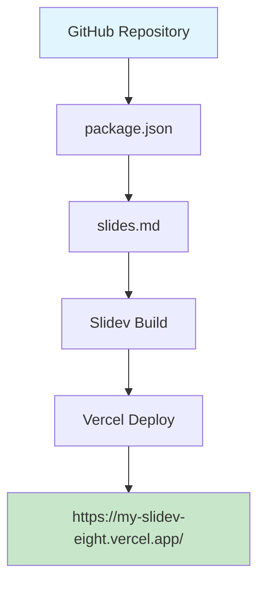
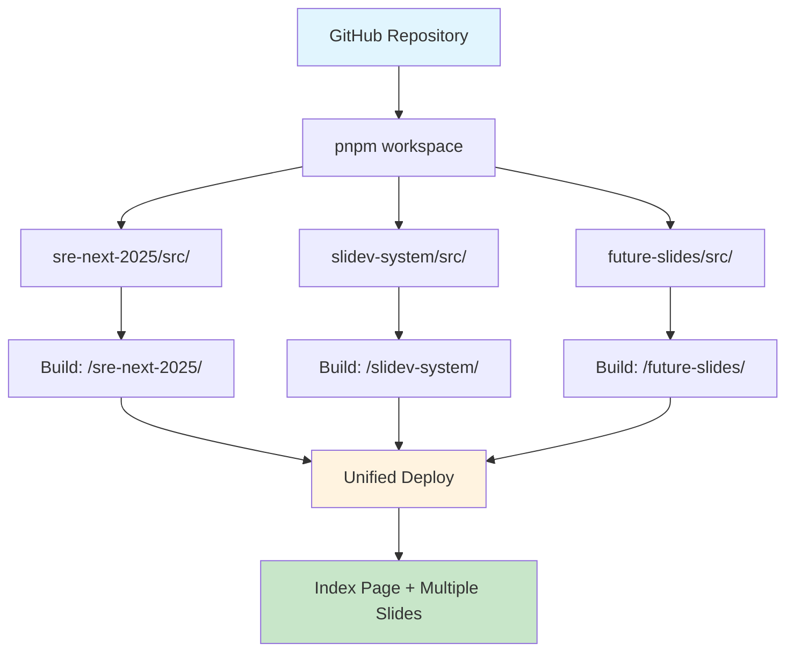

# Slidev Multiple Presentations System

複数のSlidevプレゼンテーションを1つのリポジトリで管理するシステム

<div class="pt-12">
  <span @click="$slidev.nav.next" class="px-2 py-1 rounded cursor-pointer" hover="bg-white bg-opacity-10">
    Press Space for next page <carbon:arrow-right class="inline"/>
  </span>
</div>

<div class="abs-br m-6 flex gap-2">
  <button @click="$slidev.nav.openInEditor()" title="Open in Editor" class="text-xl slidev-icon-btn opacity-50 !border-none !hover:text-white">
    <carbon:edit />
  </button>
  <a href="https://github.com/wwlapaki310/my-slidev-presentations" target="_blank" alt="GitHub" title="Open in GitHub"
    class="text-xl slidev-icon-btn opacity-50 !border-none !hover:text-white">
    <carbon-logo-github />
  </a>
</div>

---
transition: fade-out
---

# 🎯 プロジェクト目標

1つのリポジトリで複数のSlidevプレゼンテーションを効率的に管理

<v-clicks>

## 🔹 現在の状況
- ✅ 基本的なSlidep構成は完了
- ✅ Vercelでのデプロイ環境構築済み
- 🚧 単一スライドから複数スライドへの移行中

## 🔹 目標アーキテクチャ
- 🎪 **マルチプレゼンテーション**: 1つのリポジトリで複数スライド管理
- 🌐 **URL分離**: `/sre-next-2025/`, `/slidev-system/` など独立したパス
- 📱 **統合インデックス**: 全プレゼンテーション一覧ページ
- 🔄 **自動ビルド**: 一括ビルド・デプロイ仕組み

</v-clicks>

---

# 🏗️ システム構成図

現在の構成と目標構成の比較

## 📊 現在の構成 (Phase 1)


<v-click>

## 🎯 目標構成 (Phase 4)


</v-click>

---

# 📋 開発ロードマップ

段階的な実装アプローチ

<div class="grid grid-cols-2 gap-4">

<div>

## ✅ Phase 1: 基盤安定化 
**Status: 完了**

- Single Slidev setup
- Basic Vercel integration  
- Root-level slides.md
- Simple routing

</div>

<div>

## 🚧 Phase 2: Workspace構成
**Status: 課題対応中**

- pnpm workspace導入
- Directory restructuring
- Build script optimization
- `/sre-next-2025/` 404修正

</div>

</div>

<div class="grid grid-cols-2 gap-4 mt-4">

<div>

## 📋 Phase 3: 複数スライド実装
**Status: 準備中**

- 2つ目のスライド追加
- URL routing system
- Independent build process
- Cross-slide navigation

</div>

<div>

## 🎯 Phase 4: システム完成
**Status: 計画中**

- Landing page with slide list
- Metadata management
- SEO optimization
- PDF export links

</div>

</div>

---

# 🔧 技術スタック詳細

各レイヤーの技術選択と設定

## Frontend Framework
- **Slidev**: Vue.js-based presentation framework
- **Vue 3**: Reactive frontend framework
- **Markdown**: Slide content format

## Build & Deployment
- **pnpm**: Workspace package manager
- **Vercel**: Hosting platform with automatic deployment
- **GitHub Actions**: CI/CD integration

## Project Structure
```
my-slidev-presentations/
├── pnpm-workspace.yaml         # Workspace configuration
├── package.json               # Root package management
├── {slide-name}/src/          # Individual presentations
│   ├── slides.md              # Slide content
│   └── package.json           # Slide-specific config
├── dist/                      # Build outputs
├── scripts/build-index.js     # Index generation
└── vercel.json               # Deployment configuration
```

---

# 📊 現在の課題と解決策

Issue #6で特定された問題への対応

<div class="grid grid-cols-2 gap-4">

<div>

## 🚨 現在の課題

1. **404エラー**: `/sre-next-2025/` がアクセス不可
2. **Workspace未完成**: pnpm workspace移行が不完全
3. **Build Process**: 複雑化したビルドスクリプトの問題
4. **Path Resolution**: 相対パス・絶対パスの不整合

</div>

<div>

## 💡 提案される解決策

1. **段階的ロールバック**: まず1つのスライドを確実に動作
2. **Simple → Complex**: 単純な構成から徐々に複雑化
3. **Build Verification**: 各段階でのビルド成果物検証
4. **Incremental Testing**: 小さい変更での動作確認

</div>

</div>

## 🔄 即座の対応方針

1. **Step 1**: 最小構成での動作確認 (最優先)
2. **Step 2**: 単一スライドでのサブパス対応
3. **Step 3**: 動作確認後にワークスペース化

---

# 🛠️ 実装アクションプラン

次に実行する具体的なステップ

## 🎯 immediate Actions (今日)

<v-clicks>

1. **Phase 2ロールバックの実行**
   - `package.json`をシンプル化
   - `slides.md`をルートに復元
   - ワークスペース設定の一時削除

2. **動作確認とテスト**
   - `/sre-next-2025/` パスでの表示確認
   - プレゼンターモードの動作確認
   - ビルドプロセスの検証

3. **成功後の次段階移行**
   - ワークスペース構成の再導入
   - 2つ目のスライド準備
   - インデックスページの改善

</v-clicks>

---

# 📈 メトリクスと成功指標

プロジェクトの進捗を測定する指標

## 🎯 Technical KPIs

<div class="grid grid-cols-2 gap-4">

<div>

### 動作率
- ✅ **Root access**: `https://my-slidev-eight.vercel.app/`
- 🚧 **Slide access**: `/sre-next-2025/` (修正中)
- 📋 **Presenter mode**: `/sre-next-2025/presenter/`
- 📋 **Overview mode**: `/sre-next-2025/overview/`

</div>

<div>

### ビルド指標
- **Build Success Rate**: Current ~75%
- **Deploy Time**: <2 minutes target
- **Bundle Size**: <5MB per slide
- **Lighthouse Score**: 95+ target

</div>

</div>

## 📊 Feature Completeness

| Feature | Phase 1 | Phase 2 | Phase 3 | Phase 4 |
|---------|---------|---------|---------|---------|
| Single Slide | ✅ | ✅ | ✅ | ✅ |
| Custom URLs | ❌ | 🚧 | ✅ | ✅ |
| Multiple Slides | ❌ | ❌ | ✅ | ✅ |
| Index Page | ❌ | ❌ | ❌ | ✅ |

---

# 🔮 Future Roadmap

長期的な機能拡張計画

<v-clicks>

## 📅 Near-term (1-2 weeks)
- 🎪 **Multi-slide System**: 3-5 presentations
- 🎨 **Theme Customization**: Per-slide themes
- 📱 **Mobile Optimization**: Responsive design
- 🔍 **Search Functionality**: Cross-slide search

## 📅 Medium-term (1-2 months)  
- 🔗 **Slide Linking**: Cross-references between presentations
- 📊 **Analytics Integration**: View tracking
- 💾 **Content Management**: YAML/JSON metadata
- 🌐 **Internationalization**: Multi-language support

## 📅 Long-term (3+ months)
- 🤖 **AI Integration**: Auto-generated summaries
- 🎬 **Video Embedding**: YouTube/Vimeo integration
- 👥 **Collaboration**: Multi-author support
- 📦 **Plugin System**: Custom extensions

</v-clicks>

---
layout: center
class: text-center
---

# Thank You!

**Slidev Multiple Presentations System**

プロジェクトの詳細は[GitHub Repository](https://github.com/wwlapaki310/my-slidev-presentations)をご覧ください

<div class="pt-12">
  <span @click="$slidev.nav.next" class="px-2 py-1 rounded cursor-pointer" hover="bg-white bg-opacity-10">
    Questions? <carbon:arrow-right class="inline"/>
  </span>
</div>

---

# Appendix: Technical References

参考資料とドキュメント

## 📚 Documentation Links

- [Slidev Official Documentation](https://sli.dev/)
- [pnpm Workspaces Guide](https://pnpm.io/workspaces)  
- [Vercel Deployment Guide](https://vercel.com/docs)
- [Vue.js 3 Documentation](https://vuejs.org/)

## 🔗 Reference Implementations

- [Zenn Article: Slidev + Cloudflare Pages](https://zenn.dev/jy8752/articles/ad565a43ba0e0a)
- [antfu/talks Repository](https://github.com/antfu/talks)
- [Slidev Examples](https://github.com/slidevjs/slidev/tree/main/examples)

## 🐛 Issue Tracking

- [Issue #7: Phase 2 Emergency Fix](https://github.com/wwlapaki310/my-slidev-presentations/issues/7)
- [Issue #6: Phase 2 Rollback](https://github.com/wwlapaki310/my-slidev-presentations/issues/6)
- [Issue #5: Phase 2 Deploy Check](https://github.com/wwlapaki310/my-slidev-presentations/issues/5)  
- [Issue #4: Workspace Migration](https://github.com/wwlapaki310/my-slidev-presentations/issues/4)
- [Issue #3: Implementation Roadmap](https://github.com/wwlapaki310/my-slidev-presentations/issues/3)
