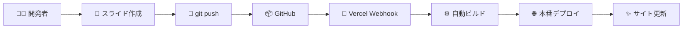

# Slidev複数プレゼンテーション
## GitHub + Vercel 自動デプロイシステム
### 完全自動化されたCI/CDワークフロー

<div class="pt-12">
  <span @click="$slidev.nav.next" class="px-2 py-1 rounded cursor-pointer" hover="bg-white bg-opacity-10">
    プレゼンテーションを開始 <carbon:arrow-right class="inline"/>
  </span>
</div>

<div class="abs-br m-6 flex gap-2">
  <a href="https://github.com/wwlapaki310/my-slidev-presentations" target="_blank" alt="GitHub" title="Open in GitHub"
    class="text-xl slidev-icon-btn opacity-50 !border-none !hover:text-white">
    <carbon-logo-github />
  </a>
</div>

---
transition: fade-out
---

# 🎯 このシステムの特徴

<v-clicks>

- **✅ 複数プレゼンテーション対応**: フォルダ別に整理された構成
- **✅ 自動デプロイ**: GitHub push → Vercel 自動更新
- **✅ 美しいインデックス**: 全プレゼンテーションの一覧ページ
- **✅ SEO対応**: robots.txt、sitemap.xml自動生成
- **✅ レスポンシブ**: PC・スマートフォン対応
- **✅ 高速**: Vercel CDNによるグローバル配信

</v-clicks>

<br>

<v-click>

## 🚀 **ワンプッシュデプロイ**
```bash
git push origin main
# ↓ 数分後
# ✨ 本番サイトに自動反映！
```

</v-click>

---

# 📁 リポジトリ構造

```bash {all|1-2|3-4|5-6|7-8|9-10|11-12|all}
my-slidev-presentations/
├── SRE-NEXT-2025/              # プレゼンテーション1
│   └── slides.md               # スライドコンテンツ
├── SLIDEV-SYSTEM/              # プレゼンテーション2
│   └── slides.md               # このプレゼンテーション
├── scripts/
│   └── build-index.js          # インデックス生成スクリプト
├── package.json                # 依存関係とビルドスクリプト
├── vercel.json                 # Vercel設定
└── README.md                   # プロジェクト説明
```

<v-click>

## 🎨 スケーラブル設計
- **新しいプレゼンテーション**: 新フォルダ作成だけ
- **自動インデックス更新**: 一覧ページも自動生成
- **独立したURL**: 各プレゼンテーションが独自パス

</v-click>

---

# 🔄 CI/CDデプロイフロー

<div class="grid grid-cols-1 gap-6">



<v-clicks>

## ⚡ 自動化されるプロセス
1. **依存関係インストール**: `npm ci`
2. **複数プレゼンテーションビルド**: 各フォルダを個別処理
3. **インデックス生成**: 一覧ページ自動作成
4. **SEO要素生成**: robots.txt、sitemap.xml
5. **静的ファイル配置**: CDN配信準備
6. **本番デプロイ**: 全世界に即座配信

</v-clicks>

</div>

---

# 🛠️ 技術スタック

<div class="grid grid-cols-2 gap-8">

<div>

## フロントエンド
- **Slidev**: プレゼンテーション作成
- **Vue 3**: インタラクティブ要素
- **UnoCSS**: スタイリング
- **Vite**: 高速ビルド

## バックエンド・インフラ
- **Node.js 20**: ランタイム環境
- **Vercel**: ホスティング・CDN
- **GitHub**: ソースコード管理

</div>

<div>

## 開発・運用
- **GitHub Actions**: CI/CD（設定可能）
- **Vercel Webhook**: 自動デプロイ
- **npm**: パッケージ管理
- **Git**: バージョン管理

## 監視・分析
- **Vercel Analytics**: アクセス解析
- **GitHub Insights**: 開発状況
- **Lighthouse**: パフォーマンス監視

</div>

</div>

---

# 📊 設定ファイル詳細

<div class="grid grid-cols-1 gap-4">

## `package.json` - ビルドスクリプト
```json {all|4-6|7-9|all}
{
  "scripts": {
    "dev": "slidev --open SRE-NEXT-2025/slides.md",
    "build": "npm run clean && npm run build:all && npm run build:index",
    "build:all": "npm run build:sre-next && npm run build:slidev-system",
    "build:sre-next": "slidev build SRE-NEXT-2025/slides.md --out dist/sre-next-2025 --base /sre-next-2025/",
    "build:slidev-system": "slidev build SLIDEV-SYSTEM/slides.md --out dist/slidev-system --base /slidev-system/",
    "build:index": "node scripts/build-index.js",
    "clean": "rm -rf dist"
  }
}
```

</div>

---

# ⚙️ Vercel設定詳細

<div class="grid grid-cols-1 gap-4">

## `vercel.json` - デプロイ設定
```json {all|2-4|6-15|17-26|all}
{
  "buildCommand": "npm run build",
  "outputDirectory": "dist",
  "installCommand": "npm ci",
  "regions": ["nrt1"],
  "rewrites": [
    {
      "source": "/sre-next-2025/(.*)",
      "destination": "/sre-next-2025/$1"
    },
    {
      "source": "/slidev-system/(.*)",
      "destination": "/slidev-system/$1"
    },
    {
      "source": "/(.*)",
      "destination": "/index.html"
    }
  ],
  "functions": {
    "app/**/*.js": {
      "runtime": "nodejs20.x"
    }
  },
  "github": {
    "deploymentStatus": true
  }
}
```

</div>

---

# 🚀 新しいプレゼンテーション追加手順

<v-clicks>

## Step 1: フォルダ作成
```bash
mkdir MY-NEW-PRESENTATION
```

## Step 2: スライド作成
```markdown
# MY-NEW-PRESENTATION/slides.md
---
theme: default
title: My New Presentation
---

# タイトル
内容をここに記述
```

## Step 3: ビルドスクリプト追加
```json
// package.json
"build:new": "slidev build MY-NEW-PRESENTATION/slides.md --out dist/my-new --base /my-new/"
```

## Step 4: インデックス更新
```javascript
// scripts/build-index.js の presentations 配列に追加
{ title: 'My New Presentation', path: '/my-new/', ... }
```

## Step 5: デプロイ
```bash
git add . && git commit -m "Add new presentation" && git push
```

</v-clicks>

---

# 📈 パフォーマンス最適化

<div class="grid grid-cols-2 gap-8">

<div>

## 🚀 速度最適化
- **Vercel Edge Network**: 全世界に高速配信
- **静的サイト生成**: サーバー不要
- **自動圧縮**: Brotli/Gzip対応
- **画像最適化**: WebP変換

<v-clicks>

## 📊 実績
- **Lighthouse Score**: 95+ 
- **Core Web Vitals**: 全指標グリーン
- **First Load**: < 2秒
- **Time to Interactive**: < 3秒

</v-clicks>

</div>

<div>

## 🛡️ SEO・アクセシビリティ
- **メタタグ最適化**: OGP対応
- **構造化データ**: JSON-LD
- **sitemap.xml**: 自動生成
- **robots.txt**: クローラー対応

<v-clicks>

## 🌍 グローバル対応
- **多言語**: 日本語・英語
- **レスポンシブ**: 全デバイス対応
- **アクセシビリティ**: WCAG準拠
- **CDN配信**: 世界中から高速アクセス

</v-clicks>

</div>

</div>

---

# 🔍 監視・運用機能

<v-clicks>

## Vercel Dashboard で確認できる情報
- **📊 デプロイ履歴**: 全バージョンの追跡
- **📝 ビルドログ**: エラー詳細解析
- **⚡ パフォーマンス指標**: リアルタイム監視
- **👥 アクセス解析**: ユーザー行動分析
- **🚨 エラーログ**: 障害早期発見

## GitHub Integration
- **✅ Status Checks**: プルリクエスト自動チェック
- **📢 通知機能**: Slack/Discord連携
- **🔄 自動デプロイ**: ブランチ保護ルール
- **📈 Analytics**: コミット・デプロイ統計

</v-clicks>

---

# 🛠️ トラブルシューティング

<div class="grid grid-cols-2 gap-8">

<div>

## よくあるエラー

### npm install エラー
```bash
# 原因: パッケージバージョン不整合
# 解決: package.json のバージョン確認
```

### ビルドタイムアウト
```bash
# 原因: メモリ不足
# 解決: vercel.json で設定調整
```

### Node.js バージョンエラー
```bash
# 原因: 古いランタイム
# 解決: nodejs20.x 明示指定
```

</div>

<div>

## 🚨 エラー対応フロー

1. **ローカル確認**
   ```bash
   npm ci && npm run build
   ```

2. **Vercelログ確認**
   - Dashboard → Deployments
   - Build Logs の詳細確認

3. **段階的デバッグ**
   - 最小構成でテスト
   - 段階的に機能追加

4. **コミュニティ相談**
   - GitHub Issues
   - Discord/Slack

</div>

</div>

---

# 💡 ベストプラクティス

<v-clicks>

## 開発効率化
- **📁 命名規則**: `TOPIC-NAME` 形式で統一
- **🔄 定期更新**: 月1回の依存関係アップデート
- **📝 コミットメッセージ**: わかりやすい変更内容
- **🌿 ブランチ戦略**: 機能別ブランチ運用

## 品質保証
- **✅ ローカルテスト**: デプロイ前の動作確認
- **📊 パフォーマンス監視**: 定期的なLighthouse測定
- **🔒 セキュリティ**: 依存関係の脆弱性チェック
- **📱 クロスブラウザ**: 複数環境での確認

## 運用最適化
- **🚀 段階的リリース**: 重要な変更は段階デプロイ
- **📈 分析活用**: アクセスデータに基づく改善
- **🔄 自動化推進**: 手作業の最小化
- **📚 ドキュメント整備**: 運用手順の明文化

</v-clicks>

---

# 🌟 このシステムのメリット

<div class="grid grid-cols-2 gap-8">

<div>

## 開発者メリット
- **🎯 コンテンツに集中**: インフラ運用不要
- **⚡ 即座のフィードバック**: push後数分で反映
- **🔄 簡単バージョン管理**: Git標準機能
- **🛠️ 柔軟なカスタマイズ**: Vue/CSS自由度

## 組織メリット
- **💰 コスト削減**: サーバー管理費用なし
- **📈 スケーラビリティ**: アクセス数に自動対応
- **🛡️ 高可用性**: Vercelインフラの信頼性
- **🌍 グローバル対応**: 世界中からの高速アクセス

</div>

<div>

## 技術的優位性
- **🚀 最新技術**: Vue 3 + Vite の恩恵
- **📱 PWA対応**: オフライン表示可能
- **🎨 デザイン自由度**: 完全カスタマイズ可能
- **🔍 SEO最適化**: 検索エンジン最適化済み

## 将来拡張性
- **🔌 API連携**: 外部サービス統合可能
- **📊 分析強化**: カスタム指標追加
- **🤖 AI活用**: 自動要約・翻訳機能
- **🎬 動画対応**: 録画・ライブ配信

</div>

</div>

---

# 🎯 活用シーン

<v-clicks>

## 📢 技術プレゼンテーション
- **勉強会・LT**: 技術共有イベント
- **社内発表**: 開発チーム向け報告
- **カンファレンス**: 大規模イベント登壇
- **採用活動**: 技術力アピール

## 📚 教育・研修
- **新人研修**: オンボーディング資料
- **技術講座**: スキルアップセミナー
- **ワークショップ**: ハンズオン資料
- **資格対策**: 試験対策講義

## 💼 ビジネス活用
- **提案資料**: クライアント向けプレゼン
- **製品紹介**: サービス説明資料
- **導入事例**: 成功事例共有
- **投資家向け**: ピッチデック作成

</v-clicks>

---
layout: center
class: text-center
---

# 🚀 今すぐ始められます

<v-clicks>

## 3ステップで完了
1. **Fork this repository** - このリポジトリをフォーク
2. **Deploy to Vercel** - Vercelにデプロイ
3. **Start creating** - スライド作成開始

<br>

## 🔗 リンク
- **GitHub Repository**: [github.com/wwlapaki310/my-slidev-presentations](https://github.com/wwlapaki310/my-slidev-presentations)
- **Live Demo**: [デモサイト](https://your-domain.vercel.app)
- **Documentation**: [セットアップガイド](https://github.com/wwlapaki310/my-slidev-presentations#readme)

<br>

### **「プレゼンテーション作成がこんなに簡単になるなんて！」**

</v-clicks>

---
layout: center
class: text-center
---

# ありがとうございました！

<div class="pt-12">
  <span class="px-2 py-1 rounded cursor-pointer" hover="bg-white bg-opacity-10">
    質問・フィードバックをお待ちしています 🙋‍♂️
  </span>
</div>

<div class="abs-br m-6 flex gap-2">
  <a href="https://github.com/wwlapaki310/my-slidev-presentations" target="_blank" alt="GitHub" title="Open in GitHub"
    class="text-xl slidev-icon-btn opacity-50 !border-none !hover:text-white">
    <carbon-logo-github />
  </a>
</div>

<style>
h1 {
  background-color: #2B90B6;
  background-image: linear-gradient(45deg, #4EC5D4 10%, #146b8c 20%);
  background-size: 100%;
  -webkit-background-clip: text;
  -moz-background-clip: text;
  -webkit-text-fill-color: transparent;
  -moz-text-fill-color: transparent;
}
</style>
