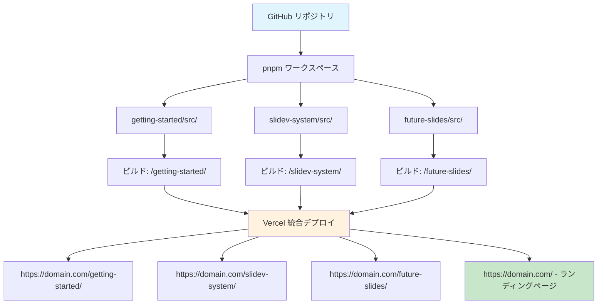

# Slidev × Vercel
## 複数スライド管理システム

**開発者のための効率的なプレゼンテーション管理システム**

<div class="pt-12">
  <span @click="$slidev.nav.next" class="px-2 py-1 rounded cursor-pointer" hover="bg-white bg-opacity-10">
    システム概要を開始 <carbon:arrow-right class="inline"/>
  </span>
</div>

<div class="abs-br m-6 flex gap-2">
  <button @click="$slidev.nav.openInEditor()" title="エディターで開く" class="text-xl slidev-icon-btn opacity-50 !border-none !hover:text-white">
    <carbon:edit />
  </button>
  <a href="https://github.com/wwlapaki310/my-slidev-presentations" target="_blank" alt="GitHub" title="GitHubで開く"
    class="text-xl slidev-icon-btn opacity-50 !border-none !hover:text-white">
    <carbon-logo-github />
  </a>
</div>

---
transition: fade-out
---

# 🎯 システムの目標

一つのリポジトリで複数のSlidevプレゼンテーションを効率的に管理する

<v-clicks>

## 従来の課題
- **リポジトリの分散**: プレゼンテーションごとに個別のリポジトリ
- **デプロイの重複**: 同じ設定を何度も作成
- **管理の複雑さ**: 複数のURLとドメインの管理
- **リソースの非効率**: テーマやコンポーネントの重複

## 解決すること
- **統合管理**: 全プレゼンテーションを1つのリポジトリで
- **自動デプロイ**: Vercelでの一括デプロイ
- **URL の一貫性**: 一つのドメイン配下に複数スライド
- **効率的な開発**: 設定やコンポーネントの共有

</v-clicks>

---

# 🏗️ システムアーキテクチャ

## アーキテクチャ図



---

# 📁 プロジェクト構造

実際のディレクトリ構造とファイル配置

```
my-slidev-presentations/
├── pnpm-workspace.yaml          # ワークスペース設定
├── package.json                 # ルートパッケージ管理
├── vercel.json                  # デプロイ・ルーティング設定
├── 
├── slides/                      # 全プレゼンテーションディレクトリ
│   └── slidev-system/           # システム概要プレゼンテーション
│       └── src/
│           ├── slides.md        # このスライドの内容！
│           └── package.json     # 個別ビルド設定
│
├── dist/                        # ビルド成果物
│   ├── slidev-system/           # ビルドされたプレゼンテーション
│   └── index.html               # 生成されたランディングページ
│
└── scripts/
    ├── build-index.js           # ランディングページ生成器
    ├── create-slide.js          # 新規スライド作成ツール
    └── slide-metadata.json      # プレゼンテーションメタデータ
```

---

# ⚙️ 技術スタック詳細

構成要素と技術選択

<div class="grid grid-cols-2 gap-8">

<div>

## フロントエンド
- **Slidev 52.0.0**: Vue.jsベースのプレゼンテーションフレームワーク
- **Vue 3**: リアクティブコンポーネント
- **Markdown**: 直感的なスライド記述
- **Mermaid**: 図表・フローチャート

## ビルド・デプロイ
- **pnpm ワークスペース**: モノレポ管理
- **Vercel**: ホスティング + CI/CD
- **GitHub Actions**: 自動化ワークフロー

</div>

<div>

## パッケージ管理
- **npm/pnpm**: 依存関係解決
- **package-lock.json**: 決定論的ビルド
- **独立バージョニング**: スライドごとの依存関係管理

## ルーティング
- **Vercel リライト**: SPA スタイルルーティング
- **ベースパス**: 各スライドの独立パス
- **静的生成**: 高速ローディング

</div>

</div>

---

# 🔧 コア技術：pnpm ワークスペース

効率的なマルチパッケージ管理

<v-clicks>

## pnpm-workspace.yaml
```yaml
packages:
  - "slides/*/src"
```

## 個別スライドのpackage.json例
```json
{
  "name": "slidev-system",
  "scripts": {
    "build": "slidev build --base /slidev-system/ --out ../../../dist/slidev-system"
  },
  "dependencies": {
    "@slidev/cli": "52.0.0",
    "@slidev/theme-default": "latest"
  }
}
```

## メリット
- **依存関係の共有**: 重複パッケージの削減
- **独立ビルド**: 各スライドを個別にビルド可能
- **統合管理**: 一つのルートから全てをコントロール

</v-clicks>

---

# 🌐 Vercel ルーティング設定

複数プレゼンテーションのための適切なルーティング

<v-clicks>

## vercel.json 設定
```json
{
  "rewrites": [
    { 
      "source": "/slidev-system/:path*", 
      "destination": "/slidev-system/:path*" 
    }
  ]
}
```

## URL 構造
- `https://my-slidev-eight.vercel.app/` - ランディングページ
- `https://my-slidev-eight.vercel.app/slidev-system/` - このプレゼンテーション
- `https://my-slidev-eight.vercel.app/slidev-system/presenter/` - 発表者モード
- `https://my-slidev-eight.vercel.app/slidev-system/overview/` - 概要モード

</v-clicks>

---

# 🏗️ ビルドプロセス詳細

ルートpackage.jsonによる統合ビルド管理

<v-clicks>

## ルート package.json
```json
{
  "name": "my-slidev-presentations",
  "scripts": {
    "build": "npm run build:slidev-system && npm run build:index",
    "build:slidev-system": "cd slides/slidev-system/src && npm run build",
    "build:index": "node scripts/build-index.js",
    "dev:slidev-system": "cd slides/slidev-system/src && npm run dev"
  }
}
```

## ビルドフロー
1. **依存関係インストール**: `npm install`（全ワークスペース）
2. **個別ビルド**: 各スライドが`dist/`に出力
3. **インデックス生成**: `scripts/build-index.js`でランディングページ作成
4. **Vercel デプロイ**: 全ファイルを自動公開

</v-clicks>

---

# 📊 運用上のメリット

実際の開発・運用での利点

<div class="grid grid-cols-2 gap-4">

<div>

## 🚀 開発効率
<v-clicks>

- **統一環境**: 一つのIDEで全スライドを編集
- **設定共有**: ESLint、Prettierなどの統一設定
- **リアルタイムプレビュー**: `npm run dev:*`で即座にプレビュー
- **Git 履歴**: 一元化された変更管理

</v-clicks>

</div>

<div>

## 🎯 管理効率
<v-clicks>

- **単一リポジトリ**: 統一されたPRレビューとCI
- **自動デプロイ**: プッシュで全スライドが更新
- **統一ドメイン**: URL管理の簡素化
- **バックアップ**: 全プレゼンテーションの一括保護

</v-clicks>

</div>

</div>

<br>

<v-click>

## 🎪 拡張性
- **簡単追加**: 新しいディレクトリ作成で即座に新スライド
- **独立性**: 各スライドが独立してビルド・更新
- **テーマ共有**: 共通のコンポーネントやスタイルの再利用

</v-click>

---
layout: center
class: text-center
---

# まとめ

**Slidev × Vercel による効率的な複数スライド管理**

<v-clicks>

## ✨ 重要ポイント
- **単一リポジトリ**: 全プレゼンテーションの統合管理
- **自動デプロイ**: GitHubプッシュで即座に公開
- **拡張可能**: 簡単なスライド追加
- **効率的**: 設定共有とリソース再利用

## 🎯 効果
- **開発時間短縮**: 新規スライド作成30分以内
- **管理コスト削減**: 複数ドメイン運用不要
- **品質向上**: 統一されたテーマとスタイル
- **保守性向上**: 一元化された管理とバックアップ

</v-clicks>

<v-click>

### **今日から複数スライド管理を始めませんか？**

</v-click>

---
layout: center
class: text-center
---

# ありがとうございました！

<div class="pt-12">
  <span class="px-2 py-1 rounded cursor-pointer" hover="bg-white bg-opacity-10">
    ご質問・フィードバックをお待ちしています 🙋‍♂️
  </span>
</div>

<div class="abs-br m-6 flex gap-2">
  <a href="https://github.com/wwlapaki310/my-slidev-presentations" target="_blank" alt="GitHub" title="リポジトリを見る"
    class="text-xl slidev-icon-btn opacity-50 !border-none !hover:text-white">
    <carbon-logo-github />
  </a>
</div>
