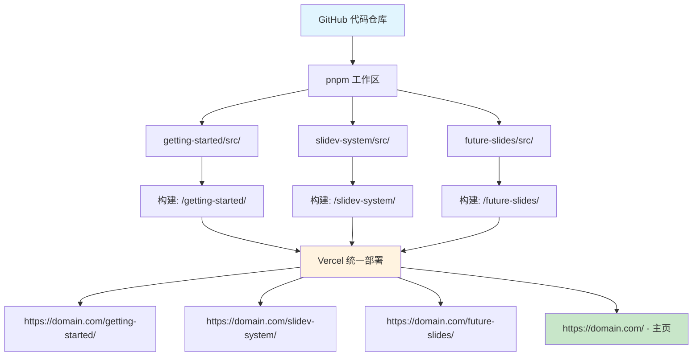

# Slidev × Vercel
## 多幻灯片管理系统

**为开发者提供的高效演示文稿管理系统**

<div class="pt-12">
  <span @click="$slidev.nav.next" class="px-2 py-1 rounded cursor-pointer" hover="bg-white bg-opacity-10">
    开始系统概览 <carbon:arrow-right class="inline"/>
  </span>
</div>

<div class="abs-br m-6 flex gap-2">
  <button @click="$slidev.nav.openInEditor()" title="在编辑器中打开" class="text-xl slidev-icon-btn opacity-50 !border-none !hover:text-white">
    <carbon:edit />
  </button>
  <a href="https://github.com/wwlapaki310/my-slidev-presentations" target="_blank" alt="GitHub" title="在 GitHub 中打开"
    class="text-xl slidev-icon-btn opacity-50 !border-none !hover:text-white">
    <carbon-logo-github />
  </a>
</div>

---
transition: fade-out
---

# 🎯 系统目标

在单个代码仓库中高效管理多个 Slidev 演示文稿

<v-clicks>

## 传统挑战
- **代码仓库分散**: 每个演示文稿都有单独的代码仓库
- **部署重复**: 多次创建相同的配置
- **管理复杂**: 管理多个 URL 和域名
- **资源低效**: 主题和组件重复

## 我们解决的问题
- **统一管理**: 在一个代码仓库中管理所有演示文稿
- **自动化部署**: 使用 Vercel 批量部署
- **URL 一致性**: 在一个域名下管理多个幻灯片
- **高效开发**: 共享配置和组件

</v-clicks>

---

# 🏗️ 系统架构

## 架构图



---

# 📁 项目结构

实际的目录结构和文件组织

```
my-slidev-presentations/
├── pnpm-workspace.yaml          # 工作区配置
├── package.json                 # 根包管理
├── vercel.json                  # 部署和路由设置
├── 
├── slides/                      # 所有演示文稿目录
│   └── slidev-system/           # 系统概览演示文稿
│       └── src/
│           ├── slides.md        # 这个幻灯片内容！
│           └── package.json     # 单独构建配置
│
├── dist/                        # 构建产物
│   ├── slidev-system/           # 构建后的演示文稿
│   └── index.html               # 生成的主页
│
└── scripts/
    ├── build-index.js           # 主页生成器
    ├── create-slide.js          # 新幻灯片创建工具
    └── slide-metadata.json      # 演示文稿元数据
```

---

# ⚙️ 技术栈详解

组件和技术选择

<div class="grid grid-cols-2 gap-8">

<div>

## 前端
- **Slidev 52.0.0**: 基于 Vue.js 的演示文稿框架
- **Vue 3**: 响应式组件
- **Markdown**: 直观的幻灯片编写
- **Mermaid**: 图表和流程图

## 构建和部署
- **pnpm 工作区**: Monorepo 管理
- **Vercel**: 托管 + CI/CD
- **GitHub Actions**: 自动化工作流

</div>

<div>

## 包管理
- **npm/pnpm**: 依赖解析
- **package-lock.json**: 确定性构建
- **独立版本管理**: 每个幻灯片的依赖管理

## 路由
- **Vercel 重写**: SPA 风格路由
- **基础路径**: 每个幻灯片的独立路径
- **静态生成**: 快速加载

</div>

</div>

---

# 🔧 核心技术: pnpm 工作区

高效的多包管理

<v-clicks>

## pnpm-workspace.yaml
```yaml
packages:
  - "slides/*/src"
```

## 单个幻灯片 package.json 示例
```json
{
  "name": "slidev-system",
  "scripts": {
    "build": "slidev build --base /slidev-system/ --out ../../../dist/slidev-system"
  },
  "dependencies": {
    "@slidev/cli": "52.0.0",
    "@slidev/theme-default": "latest"
  }
}
```

## 优势
- **共享依赖**: 减少重复包
- **独立构建**: 每个幻灯片可以单独构建
- **统一管理**: 从一个根目录控制所有内容

</v-clicks>

---

# 🌐 Vercel 路由配置

多个演示文稿的正确路由

<v-clicks>

## vercel.json 配置
```json
{
  "rewrites": [
    { 
      "source": "/slidev-system/:path*", 
      "destination": "/slidev-system/:path*" 
    },
    { 
      "source": "/slidev-system-zh/:path*", 
      "destination": "/slidev-system-zh/:path*" 
    }
  ]
}
```

## URL 结构
- `https://my-slidev-eight.vercel.app/` - 主页
- `https://my-slidev-eight.vercel.app/slidev-system/` - 英文演示文稿
- `https://my-slidev-eight.vercel.app/slidev-system-zh/` - 这个中文演示文稿
- `https://my-slidev-eight.vercel.app/slidev-system-zh/presenter/` - 演讲者模式
- `https://my-slidev-eight.vercel.app/slidev-system-zh/overview/` - 概览模式

</v-clicks>

---

# 🏗️ 构建过程详解

使用根 package.json 进行集成构建管理

<v-clicks>

## 根 package.json
```json
{
  "name": "my-slidev-presentations",
  "scripts": {
    "build": "npm run build:slidev-system && npm run build:slidev-system-zh && npm run build:index",
    "build:slidev-system": "cd slides/slidev-system/src && npm run build",
    "build:slidev-system-zh": "cd slides/slidev-system-zh/src && npm run build",
    "build:index": "node scripts/build-index.js",
    "dev:slidev-system-zh": "cd slides/slidev-system-zh/src && npm run dev"
  }
}
```

## 构建流程
1. **安装依赖**: `npm install` (所有工作区)
2. **单独构建**: 每个幻灯片输出到 `dist/`
3. **索引生成**: `scripts/build-index.js` 创建主页
4. **Vercel 部署**: 自动发布所有文件

</v-clicks>

---

# 📊 运营优势

实际开发和运营的优势

<div class="grid grid-cols-2 gap-4">

<div>

## 🚀 开发效率
<v-clicks>

- **统一环境**: 在一个 IDE 中编辑所有幻灯片
- **共享配置**: 统一的 ESLint、Prettier 等
- **实时预览**: `npm run dev:*` 实时预览
- **Git 历史**: 集中变更管理

</v-clicks>

</div>

<div>

## 🎯 管理效率
<v-clicks>

- **单一代码仓库**: 统一的 PR 审查和 CI
- **自动部署**: 推送时所有幻灯片更新
- **统一域名**: 简化 URL 管理
- **备份**: 所有演示文稿的批量保护

</v-clicks>

</div>

</div>

<br>

<v-click>

## 🎪 可扩展性
- **轻松添加**: 创建新目录即可添加新幻灯片
- **独立性**: 每个幻灯片独立构建和更新
- **共享主题**: 重用通用组件和样式

</v-click>

---

# 🛠️ 实施最佳实践

高效开发和运营的建议

<v-clicks>

## 📝 目录命名约定
- **短横线命名**: `getting-started`、`slidev-system`
- **有意义的名称**: 内容描述性命名
- **URL 考虑**: 名称直接成为 URL

## 🔧 package.json 配置
- **基础路径必需**: `--base /slide-name/` 必须
- **统一输出**: `--out ../../../dist/slide-name`
- **依赖管理**: 只包含每个幻灯片需要的内容

## 🎨 共享资源
- **主题一致性**: 通用使用 `@slidev/theme-default`
- **资源管理**: 将图片放在各个幻灯片目录中
- **样式共享**: 需要时使用 CSS 变量保持一致性

</v-clicks>

---

# 🚧 挑战和解决方案

实施过程中遇到的问题和解决方案

<div class="grid grid-cols-2 gap-4">

<div>

## ⚠️ 遇到的问题

<v-clicks>

### npm ci 错误
- **原因**: pnpm-lock.yaml 和 package-lock.json 冲突
- **症状**: Vercel 部署期间依赖解析失败

### 404 错误
- **原因**: Vercel 路由和基础路径不匹配
- **症状**: 无法访问 `/slidev-system/`

### 构建复杂性
- **原因**: 复杂的多幻灯片构建管理
- **症状**: 难以识别哪个幻灯片有错误

</v-clicks>

</div>

<div>

## ✅ 解决方案

<v-clicks>

### 统一包管理
- **npm install**: 灵活的依赖解析
- **vercel.json**: 明确的 installCommand 规范
- **逐步引入**: 逐个添加幻灯片

### 路由优化
- **简单的 vercel.json**: 最小必要配置
- **一致的基础路径**: 幻灯片名称与 URL 对齐
- **单独测试**: 独立验证每个幻灯片

### 改进调试
- **详细日志**: 明确每个构建步骤
- **Issue 管理**: GitHub 上的渐进式跟踪

</v-clicks>

</div>

</div>

---

# 📈 性能优化

实现快速高效的系统

<v-clicks>

## ⚡ 构建优化
- **并行构建**: 使用 `&` 而不是 `&&` 进行并发执行
- **增量构建**: 只重建更改的幻灯片
- **缓存利用**: 最大化 Vercel 构建缓存使用

## 🌐 交付优化
- **CDN 使用**: 通过 Vercel Edge 快速交付
- **静态优化**: 作为 SPA 预构建
- **图像优化**: 使用 WebP 格式轻量化

## 📱 用户体验改进
- **快速导航**: 客户端路由
- **预加载**: 预加载相关幻灯片
- **响应式**: 移动端优化设计

</v-clicks>

---

# 🔄 运营工作流

日常开发和更新流程

<v-clicks>

## 📝 添加新幻灯片
1. **创建目录**: `new-slide/src/`
2. **配置 package.json**: 基础路径和构建设置
3. **创建 slides.md**: 用 Markdown 编写幻灯片内容
4. **更新根 package.json**: 添加构建脚本
5. **更新 vercel.json**: 添加路由配置
6. **更新元数据**: 将幻灯片信息添加到 `slide-metadata.json`

## 🔧 更新现有幻灯片
1. **在目标目录中工作**: `cd target-slide/src`
2. **本地验证**: `npm run dev`
3. **提交和推送**: 用 Git 历史管理
4. **自动部署**: 通过 Vercel 自动反映

## 🚀 紧急修复
- **热修复响应**: 只修复受影响的幻灯片
- **即时部署**: 推送后几分钟内反映
- **回滚**: 使用 Git revert 即时恢复

</v-clicks>

---

# 📊 当前实施状态

项目进展和成就

<div class="grid grid-cols-2 gap-4">

<div>

## ✅ 已完成功能
- **基础系统**: pnpm 工作区配置
- **多语言演示**: 英文和中文版本
- **自动部署**: Vercel 集成
- **路由**: 多路径支持
- **文档**: README.md 设置
- **OSS 就绪**: 多语言本地化

## 📊 性能指标
- **构建时间**: ~2 分钟
- **部署时间**: ~30 秒
- **页面加载**: <1 秒
- **Lighthouse 分数**: 95+

</div>

<div>

## 🚧 未来增强
- **着陆页**: 集成索引
- **搜索功能**: 跨幻灯片搜索
- **元数据管理**: YAML frontmatter
- **主题定制**: 统一品牌
- **分析**: 访问分析集成

## 🎯 运营目标
- **月度更新**: 添加新演示文稿
- **质量维护**: 保持 95+ Lighthouse 分数
- **可用性**: 99.9% 正常运行时间
- **开发效率**: 新幻灯片添加 <30 分钟

</div>

</div>

---

# 🔮 未来发展

系统可扩展性潜力

<v-clicks>

## 🎪 功能扩展
- **多语言支持**: 国际化 (i18n)
- **实时协作**: 多用户同时编辑
- **演示文稿录制**: 视频输出功能
- **交互元素**: 测验和投票系统

## 🔗 系统集成
- **CMS 集成**: 与 Notion、Contentful 等集成
- **API 开发**: 演示文稿信息的 REST API
- **Slack 集成**: 自动更新通知
- **分析仪表板**: 访问状态可视化

## ☁️ 基础设施演进
- **多云**: AWS、GCP 支持
- **边缘计算**: 更快的交付
- **AI 集成**: 自动幻灯片生成和优化

</v-clicks>

---

# 💡 经验教训和技巧

通过实施获得的见解

<v-clicks>

## 🎯 技术经验
- **增量实施**: 从复杂系统的小处开始
- **简单优先**: 最小配置获得最大效果
- **错误处理**: 每个阶段充分测试
- **文档**: 与实施同时记录

## 🔄 运营经验
- **自动化重要性**: 手动工作总是导致错误
- **监控**: 定期运营检查是必需的
- **备份**: Git 历史之外的外部存储
- **团队共享**: 创建系统避免知识孤岛

## 🚀 效率技巧
- **模板使用**: 标准化新幻灯片创建
- **热重载**: 开发期间即时反映
- **预览环境**: 生产前验证

</v-clicks>

---

# 🎉 用例和示例

实际应用

<div class="grid grid-cols-2 gap-4">

<div>

## 💼 企业应用
<v-clicks>

- **产品发布**: 季度产品路线图
- **技术学习小组**: 内部 LT 活动演示文稿
- **培训材料**: 新员工培训幻灯片
- **销售材料**: 提案演示文稿

</v-clicks>

</div>

<div>

## 👨‍🏫 个人和社区
<v-clicks>

- **技术博客**: 与文章链接的幻灯片
- **会议**: 管理多个演讲材料
- **教育**: 系统性讲座幻灯片管理
- **作品集**: 积累过往演示材料

</v-clicks>

</div>

</div>

<v-click>

## 🌟 特别有效的场景
- **系列演示**: 管理连续内容
- **多人团队**: 协作幻灯片创建
- **长期项目**: 持续进度报告更新
- **模板使用**: 统一格式的大规模创建

</v-click>

---

# 📋 开始使用！

实施此系统的步骤

<v-clicks>

## 🚀 快速开始
1. **创建代码仓库**: 在 GitHub 上新建代码仓库
2. **基础文件**: `package.json`、`pnpm-workspace.yaml`
3. **第一个幻灯片**: 创建 `first-slide/src/` 目录
4. **Vercel 集成**: 连接 GitHub 代码仓库
5. **部署验证**: 确认成功的初始部署

## 📚 所需知识
- **基础**: Git、GitHub、npm/pnpm
- **Slidev**: 基于 Markdown 的幻灯片创建
- **Vercel**: 基本部署操作
- **推荐**: Vue.js、TypeScript（高级功能）

## 🛠️ 推荐环境
- **编辑器**: VS Code（带 Slidev 扩展）
- **Node.js**: 18.x 或更高版本
- **浏览器**: Chrome、Firefox（用于开发）

</v-clicks>

---
layout: center
class: text-center
---

# 总结

**使用 Slidev × Vercel 高效管理多幻灯片**

<v-clicks>

## ✨ 关键要点
- **单一代码仓库**: 所有演示文稿的统一管理
- **自动部署**: GitHub 推送即时发布
- **可扩展**: 轻松添加幻灯片
- **高效**: 共享配置和资源重用

## 🎯 影响
- **减少开发时间**: 新幻灯片创建少于 30 分钟
- **降低管理成本**: 无需多域名操作
- **提高质量**: 统一主题和样式
- **更好的可维护性**: 集中管理和备份

</v-clicks>

<v-click>

### **今天就开始您的多幻灯片管理吧？**

</v-click>

---
layout: center
class: text-center
---

# 谢谢！

<div class="pt-12">
  <span class="px-2 py-1 rounded cursor-pointer" hover="bg-white bg-opacity-10">
    欢迎提问和反馈 🙋‍♂️
  </span>
</div>

<div class="abs-br m-6 flex gap-2">
  <a href="https://github.com/wwlapaki310/my-slidev-presentations" target="_blank" alt="GitHub" title="查看代码仓库"
    class="text-xl slidev-icon-btn opacity-50 !border-none !hover:text-white">
    <carbon-logo-github />
  </a>
</div>

---

# 参考资料

<div class="grid grid-cols-2 gap-8">

<div>

## 📚 官方文档
- [Slidev 官方网站](https://sli.dev/)
- [pnpm 工作区](https://pnpm.io/workspaces)
- [Vercel 文档](https://vercel.com/docs)
- [Vue.js 官网](https://vuejs.org/)

## 🔗 参考实现
- [本项目](https://github.com/wwlapaki310/my-slidev-presentations)
- [antfu/talks](https://github.com/antfu/talks)
- [Slidev 示例](https://github.com/slidevjs/slidev/tree/main/demo)

</div>

<div>

## 🛠️ 开发工具
- [VS Code Slidev 扩展](https://marketplace.visualstudio.com/items?itemName=antfu.slidev)
- [GitHub Desktop](https://desktop.github.com/)
- [Vercel CLI](https://vercel.com/cli)

## 💬 社区
- [Slidev Discord](https://discord.gg/UBN2mTnw)
- [Vue.js 社区](https://discord.com/invite/vue)
- [GitHub 讨论](https://github.com/slidevjs/slidev/discussions)

</div>

</div>

<style>
h1 {
  background-color: #2B90B6;
  background-image: linear-gradient(45deg, #4EC5D4 10%, #146b8c 20%);
  background-size: 100%;
  -webkit-background-clip: text;
  -moz-background-clip: text;
  -webkit-text-fill-color: transparent;
  -moz-text-fill-color: transparent;
}
</style>
