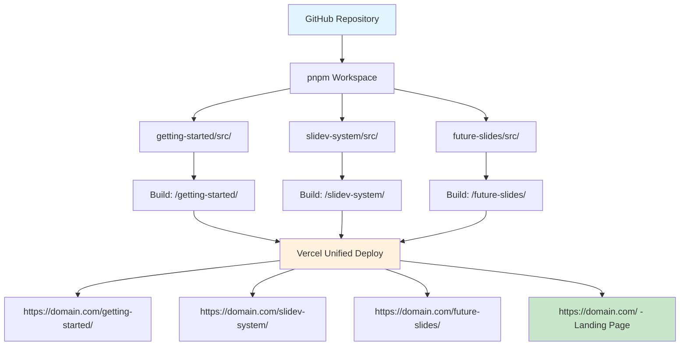

# Slidev × Vercel
## Multi-Slide Management System

**Efficient presentation management system for developers**

<div class="pt-12">
  <span @click="$slidev.nav.next" class="px-2 py-1 rounded cursor-pointer" hover="bg-white bg-opacity-10">
    Start System Overview <carbon:arrow-right class="inline"/>
  </span>
</div>

<div class="abs-br m-6 flex gap-2">
  <button @click="$slidev.nav.openInEditor()" title="Open in Editor" class="text-xl slidev-icon-btn opacity-50 !border-none !hover:text-white">
    <carbon:edit />
  </button>
  <a href="https://github.com/wwlapaki310/my-slidev-presentations" target="_blank" alt="GitHub" title="Open in GitHub"
    class="text-xl slidev-icon-btn opacity-50 !border-none !hover:text-white">
    <carbon-logo-github />
  </a>
</div>

---
transition: fade-out
---

# 🎯 System Goals

Efficiently manage multiple Slidev presentations in a single repository

<v-clicks>

## Traditional Challenges
- **Repository Fragmentation**: Separate repositories for each presentation
- **Deployment Duplication**: Recreating the same configurations multiple times
- **Management Complexity**: Managing multiple URLs and domains
- **Resource Inefficiency**: Duplicating themes and components

## What We Solve
- **Unified Management**: All presentations in one repository
- **Automated Deployment**: Bulk deployment with Vercel
- **URL Consistency**: Multiple slides under one domain
- **Efficient Development**: Shared configurations and components

</v-clicks>

---

# 🏗️ System Architecture

## Architecture Diagram



---

# 📁 Project Structure

Actual directory structure and file organization

```
my-slidev-presentations/
├── pnpm-workspace.yaml          # Workspace configuration
├── package.json                 # Root package management
├── vercel.json                  # Deployment & routing settings
├── 
├── slides/                      # All presentations directory
│   └── slidev-system/           # System overview presentation
│       └── src/
│           ├── slides.md        # This slide content!
│           └── package.json     # Individual build config
│
├── dist/                        # Build artifacts
│   ├── slidev-system/           # Built presentation
│   └── index.html               # Generated landing page
│
└── scripts/
    ├── build-index.js           # Landing page generator
    ├── create-slide.js          # New slide creation tool
    └── slide-metadata.json      # Presentation metadata
```

---

# ⚙️ Tech Stack Details

Components and technology choices

<div class="grid grid-cols-2 gap-8">

<div>

## Frontend
- **Slidev 52.0.0**: Vue.js based presentation framework
- **Vue 3**: Reactive components
- **Markdown**: Intuitive slide writing
- **Mermaid**: Diagrams and flowcharts

## Build & Deploy
- **pnpm Workspace**: Monorepo management
- **Vercel**: Hosting + CI/CD
- **GitHub Actions**: Automated workflows

</div>

<div>

## Package Management
- **npm/pnpm**: Dependency resolution
- **package-lock.json**: Deterministic builds
- **Independent Versioning**: Per-slide dependency management

## Routing
- **Vercel Rewrites**: SPA-style routing
- **Base Path**: Independent paths for each slide
- **Static Generation**: Fast loading

</div>

</div>

---

# 🔧 Core Technology: pnpm Workspace

Efficient multi-package management

<v-clicks>

## pnpm-workspace.yaml
```yaml
packages:
  - "slides/*/src"
```

## Individual slide package.json example
```json
{
  "name": "slidev-system",
  "scripts": {
    "build": "slidev build --base /slidev-system/ --out ../../../dist/slidev-system"
  },
  "dependencies": {
    "@slidev/cli": "52.0.0",
    "@slidev/theme-default": "latest"
  }
}
```

## Benefits
- **Shared Dependencies**: Reduces duplicate packages
- **Independent Builds**: Each slide can be built separately
- **Unified Management**: Control everything from one root

</v-clicks>

---

# 🌐 Vercel Routing Configuration

Proper routing for multiple presentations

<v-clicks>

## vercel.json configuration
```json
{
  "rewrites": [
    { 
      "source": "/slidev-system/:path*", 
      "destination": "/slidev-system/:path*" 
    }
  ]
}
```

## URL Structure
- `https://my-slidev-eight.vercel.app/` - Landing page
- `https://my-slidev-eight.vercel.app/slidev-system/` - This presentation
- `https://my-slidev-eight.vercel.app/slidev-system/presenter/` - Presenter mode
- `https://my-slidev-eight.vercel.app/slidev-system/overview/` - Overview mode

</v-clicks>

---

# 🏗️ Build Process Details

Integrated build management with root package.json

<v-clicks>

## Root package.json
```json
{
  "name": "my-slidev-presentations",
  "scripts": {
    "build": "npm run build:slidev-system && npm run build:index",
    "build:slidev-system": "cd slides/slidev-system/src && npm run build",
    "build:index": "node scripts/build-index.js",
    "dev:slidev-system": "cd slides/slidev-system/src && npm run dev"
  }
}
```

## Build Flow
1. **Install Dependencies**: `npm install` (all workspaces)
2. **Individual Builds**: Each slide outputs to `dist/`
3. **Index Generation**: `scripts/build-index.js` creates landing page
4. **Vercel Deploy**: Automatically publishes all files

</v-clicks>

---

# 📊 Operational Benefits

Real development and operational advantages

<div class="grid grid-cols-2 gap-4">

<div>

## 🚀 Development Efficiency
<v-clicks>

- **Unified Environment**: Edit all slides in one IDE
- **Shared Configuration**: Unified ESLint, Prettier, etc.
- **Real-time Preview**: `npm run dev:*` for instant preview
- **Git History**: Centralized change management

</v-clicks>

</div>

<div>

## 🎯 Management Efficiency
<v-clicks>

- **Single Repository**: Unified PR reviews and CI
- **Auto Deployment**: All slides update on push
- **Unified Domain**: Simplified URL management
- **Backup**: Bulk protection of all presentations

</v-clicks>

</div>

</div>

<br>

<v-click>

## 🎪 Scalability
- **Easy Addition**: Create new directory for instant new slide
- **Independence**: Each slide builds and updates independently
- **Shared Themes**: Reuse common components and styles

</v-click>

---

# 🛠️ Implementation Best Practices

Recommendations for efficient development and operations

<v-clicks>

## 📝 Directory Naming Conventions
- **Kebab Case**: `getting-started`, `slidev-system`
- **Meaningful Names**: Content-descriptive naming
- **URL Consideration**: Names become URLs directly

## 🔧 package.json Configuration
- **Base Path Required**: `--base /slide-name/` mandatory
- **Unified Output**: `--out ../../../dist/slide-name`
- **Dependency Management**: Only include what each slide needs

## 🎨 Shared Resources
- **Theme Consistency**: Common use of `@slidev/theme-default`
- **Asset Management**: Place images in individual slide directories
- **Style Sharing**: Use CSS variables for consistency when needed

</v-clicks>

---

# 🚧 Challenges and Solutions

Problems encountered during implementation and solutions

<div class="grid grid-cols-2 gap-4">

<div>

## ⚠️ Issues Encountered

<v-clicks>

### npm ci errors
- **Cause**: Conflict between pnpm-lock.yaml and package-lock.json
- **Symptom**: Dependency resolution failure during Vercel deployment

### 404 errors
- **Cause**: Mismatch between Vercel routing and base paths
- **Symptom**: Cannot access `/slidev-system/`

### Build complexity
- **Cause**: Complex multi-slide build management
- **Symptom**: Difficult to identify which slide has errors

</v-clicks>

</div>

<div>

## ✅ Solutions

<v-clicks>

### Unified package management
- **npm install**: Flexible dependency resolution
- **vercel.json**: Explicit installCommand specification
- **Gradual introduction**: Add slides one by one

### Routing optimization
- **Simple vercel.json**: Minimal necessary configuration
- **Consistent base paths**: Align slide names with URLs
- **Individual testing**: Verify each slide independently

### Improved debugging
- **Detailed logging**: Clear each build step
- **Issue management**: Progressive tracking on GitHub

</v-clicks>

</div>

</div>

---

# 📈 Performance Optimization

Achieving a fast and efficient system

<v-clicks>

## ⚡ Build Optimization
- **Parallel Builds**: Use `&` instead of `&&` for concurrent execution
- **Incremental Builds**: Rebuild only changed slides
- **Cache Utilization**: Maximize Vercel build cache usage

## 🌐 Delivery Optimization
- **CDN Usage**: Fast delivery via Vercel Edge
- **Static Optimization**: Pre-built as SPA
- **Image Optimization**: Lightweight with WebP format

## 📱 UX Improvements
- **Fast Navigation**: Client-side routing
- **Preloading**: Pre-load related slides
- **Responsive**: Mobile-optimized design

</v-clicks>

---

# 🔄 Operational Workflow

Daily development and update flow

<v-clicks>

## 📝 Adding New Slides
1. **Create Directory**: `new-slide/src/`
2. **Configure package.json**: Base path and build settings
3. **Create slides.md**: Write slide content in Markdown
4. **Update Root package.json**: Add build scripts
5. **Update vercel.json**: Add routing configuration
6. **Update metadata**: Add slide information to `slide-metadata.json`

## 🔧 Updating Existing Slides
1. **Work in Target Directory**: `cd target-slide/src`
2. **Local Verification**: `npm run dev`
3. **Commit & Push**: Manage with Git history
4. **Auto Deploy**: Automatic reflection via Vercel

## 🚀 Emergency Fixes
- **Hotfix Response**: Fix only the affected slide
- **Instant Deploy**: Reflects within minutes after push
- **Rollback**: Instant recovery with Git revert

</v-clicks>

---

# 📊 Current Implementation Status

Project progress and achievements

<div class="grid grid-cols-2 gap-4">

<div>

## ✅ Completed Features
- **Basic System**: pnpm workspace configuration
- **Single Slide Demo**: SLIDEV-SYSTEM presentation
- **Auto Deployment**: Vercel integration
- **Routing**: Multi-path support
- **Documentation**: README.md setup
- **OSS Ready**: English localization

## 📊 Performance Metrics
- **Build Time**: ~2 minutes
- **Deploy Time**: ~30 seconds
- **Page Load**: <1 second
- **Lighthouse Score**: 95+

</div>

<div>

## 🚧 Future Enhancements
- **Landing Page**: Integrated index
- **Search Function**: Cross-slide search
- **Metadata Management**: YAML frontmatter
- **Theme Customization**: Unified branding
- **Analytics**: Access analysis integration

## 🎯 Operational Goals
- **Monthly Updates**: Add new presentations
- **Quality Maintenance**: Maintain 95+ Lighthouse score
- **Availability**: 99.9% uptime
- **Development Efficiency**: New slide addition <30 minutes

</div>

</div>

---

# 🔮 Future Development

System extensibility potential

<v-clicks>

## 🎪 Feature Extensions
- **Multi-language Support**: Internationalization (i18n)
- **Real-time Collaboration**: Multi-user simultaneous editing
- **Presentation Recording**: Video output functionality
- **Interactive Elements**: Quiz and polling systems

## 🔗 System Integration
- **CMS Integration**: Integration with Notion, Contentful, etc.
- **API Development**: REST API for presentation information
- **Slack Integration**: Automatic update notifications
- **Analytics Dashboard**: Access status visualization

## ☁️ Infrastructure Evolution
- **Multi-cloud**: AWS, GCP support
- **Edge Computing**: Faster delivery
- **AI Integration**: Automatic slide generation and optimization

</v-clicks>

---

# 💡 Lessons Learned & Tips

Insights gained through implementation

<v-clicks>

## 🎯 Technical Lessons
- **Incremental Implementation**: Start small with complex systems
- **Simplicity First**: Minimal configuration for maximum effect
- **Error Handling**: Sufficient testing at each stage
- **Documentation**: Record alongside implementation

## 🔄 Operational Lessons
- **Automation Importance**: Manual work always leads to errors
- **Monitoring**: Regular operational checks are essential
- **Backup**: External storage beyond Git history
- **Team Sharing**: Create systems to avoid knowledge silos

## 🚀 Efficiency Tips
- **Template Usage**: Standardize new slide creation
- **Hot Reload**: Instant reflection during development
- **Preview Environment**: Pre-production verification

</v-clicks>

---

# 🎉 Use Cases & Examples

Real-world applications

<div class="grid grid-cols-2 gap-4">

<div>

## 💼 Enterprise Applications
<v-clicks>

- **Product Launches**: Quarterly product roadmaps
- **Tech Study Groups**: Internal LT event presentations
- **Training Materials**: New employee training slides
- **Sales Materials**: Proposal presentations

</v-clicks>

</div>

<div>

## 👨‍🏫 Personal & Community
<v-clicks>

- **Tech Blogs**: Slides linked to articles
- **Conferences**: Managing multiple speaking materials
- **Education**: Systematic lecture slide management
- **Portfolio**: Accumulating past presentation materials

</v-clicks>

</div>

</div>

<v-click>

## 🌟 Particularly Effective Scenarios
- **Series Presentations**: Managing continuous content
- **Multi-person Teams**: Collaborative slide creation
- **Long-term Projects**: Continuous progress reporting updates
- **Template Usage**: Large-scale creation with unified formats

</v-click>

---

# 📋 Getting Started!

Steps to implement this system

<v-clicks>

## 🚀 Quick Start
1. **Create Repository**: New repository on GitHub
2. **Basic Files**: `package.json`, `pnpm-workspace.yaml`
3. **First Slide**: Create `first-slide/src/` directory
4. **Vercel Integration**: Connect GitHub repository
5. **Deploy Verification**: Confirm successful initial deployment

## 📚 Required Knowledge
- **Basics**: Git, GitHub, npm/pnpm
- **Slidev**: Markdown-based slide creation
- **Vercel**: Basic deployment operations
- **Recommended**: Vue.js, TypeScript (for advanced features)

## 🛠️ Recommended Environment
- **Editor**: VS Code (with Slidev extension)
- **Node.js**: 18.x or higher
- **Browser**: Chrome, Firefox (for development)

</v-clicks>

---
layout: center
class: text-center
---

# Summary

**Efficient multi-slide management with Slidev × Vercel**

<v-clicks>

## ✨ Key Points
- **Single Repository**: Unified management of all presentations
- **Auto Deployment**: Instant publishing with GitHub push
- **Scalable**: Easy slide addition
- **Efficient**: Shared configurations and resource reuse

## 🎯 Impact
- **Reduced Development Time**: New slide creation under 30 minutes
- **Lower Management Costs**: No need for multiple domain operations
- **Improved Quality**: Unified themes and styles
- **Better Maintainability**: Centralized management and backup

</v-clicks>

<v-click>

### **Ready to start your multi-slide management today?**

</v-click>

---
layout: center
class: text-center
---

# Thank You!

<div class="pt-12">
  <span class="px-2 py-1 rounded cursor-pointer" hover="bg-white bg-opacity-10">
    Questions & feedback are welcome 🙋‍♂️
  </span>
</div>

<div class="abs-br m-6 flex gap-2">
  <a href="https://github.com/wwlapaki310/my-slidev-presentations" target="_blank" alt="GitHub" title="View Repository"
    class="text-xl slidev-icon-btn opacity-50 !border-none !hover:text-white">
    <carbon-logo-github />
  </a>
</div>

---

# References & Resources

<div class="grid grid-cols-2 gap-8">

<div>

## 📚 Official Documentation
- [Slidev Official Site](https://sli.dev/)
- [pnpm Workspaces](https://pnpm.io/workspaces)
- [Vercel Documentation](https://vercel.com/docs)
- [Vue.js Official](https://vuejs.org/)

## 🔗 Reference Implementations
- [This Project](https://github.com/wwlapaki310/my-slidev-presentations)
- [antfu/talks](https://github.com/antfu/talks)
- [Slidev Examples](https://github.com/slidevjs/slidev/tree/main/demo)

</div>

<div>

## 🛠️ Development Tools
- [VS Code Slidev Extension](https://marketplace.visualstudio.com/items?itemName=antfu.slidev)
- [GitHub Desktop](https://desktop.github.com/)
- [Vercel CLI](https://vercel.com/cli)

## 💬 Community
- [Slidev Discord](https://discord.gg/UBN2mTnw)
- [Vue.js Community](https://discord.com/invite/vue)
- [GitHub Discussions](https://github.com/slidevjs/slidev/discussions)

</div>

</div>

<style>
h1 {
  background-color: #2B90B6;
  background-image: linear-gradient(45deg, #4EC5D4 10%, #146b8c 20%);
  background-size: 100%;
  -webkit-background-clip: text;
  -moz-background-clip: text;
  -webkit-text-fill-color: transparent;
  -moz-text-fill-color: transparent;
}
</style>
